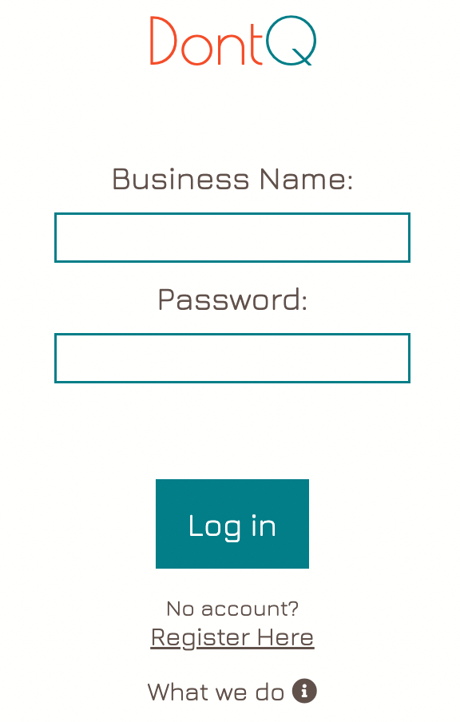
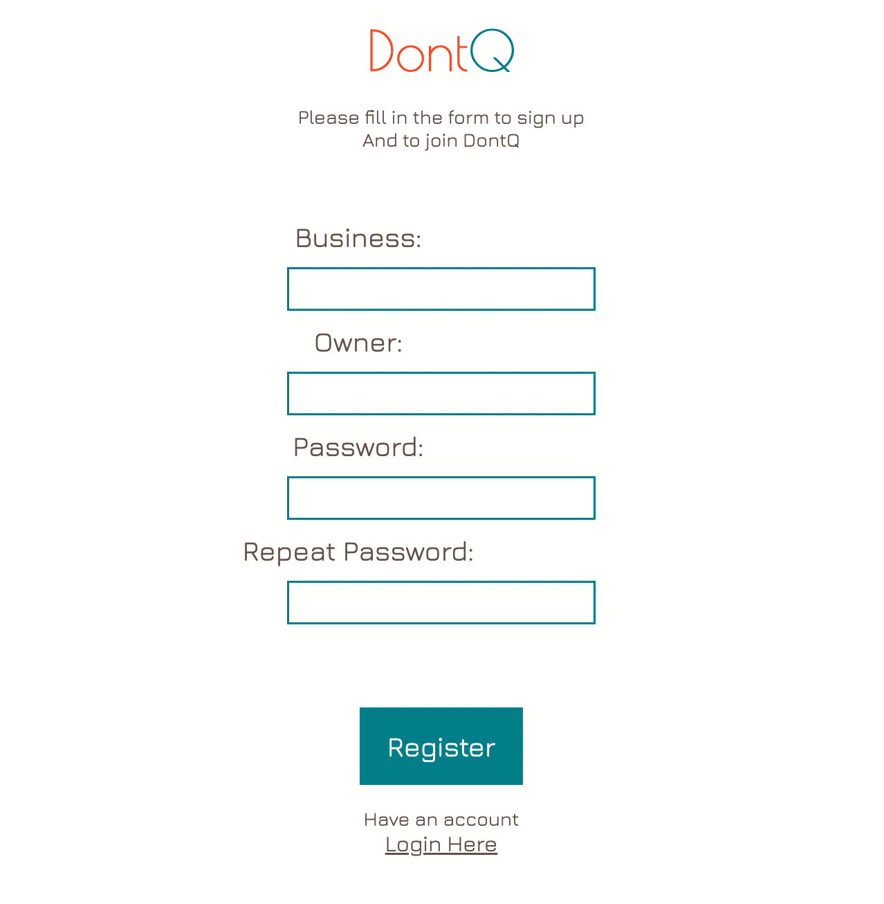
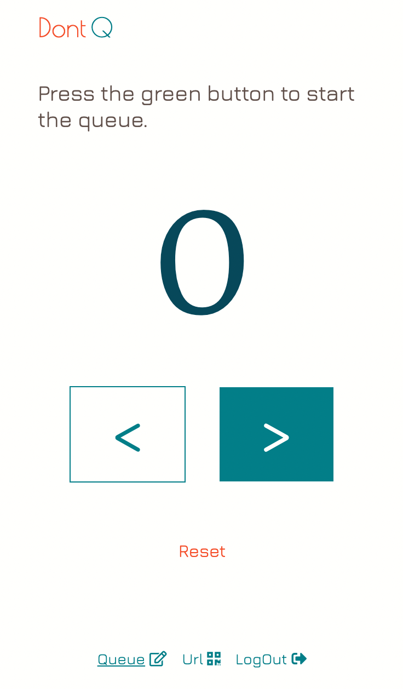
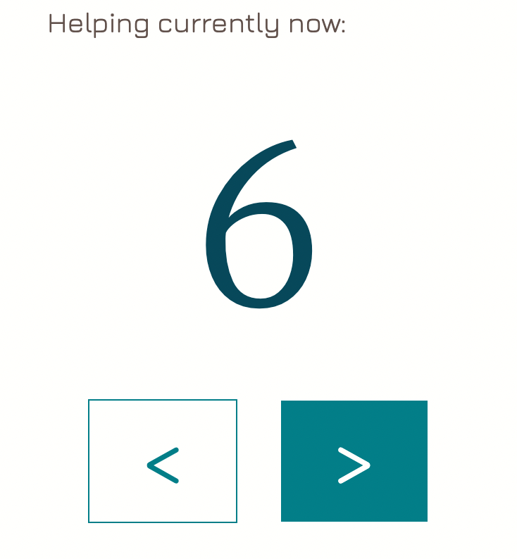
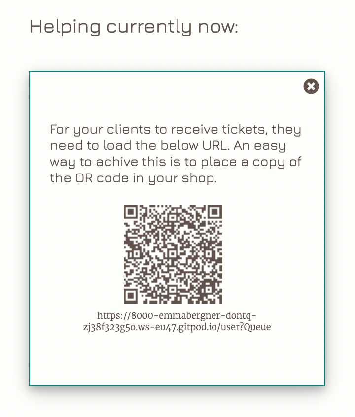
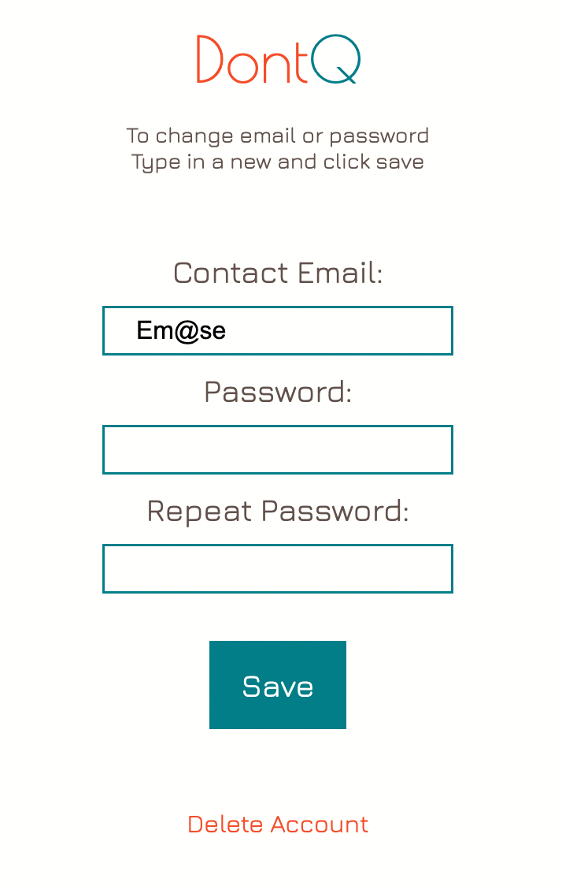
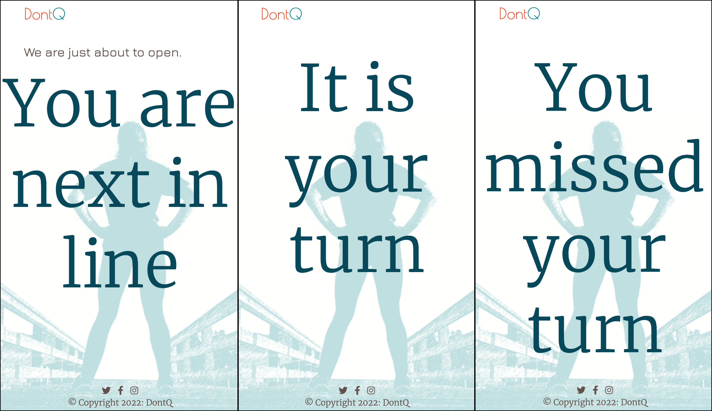
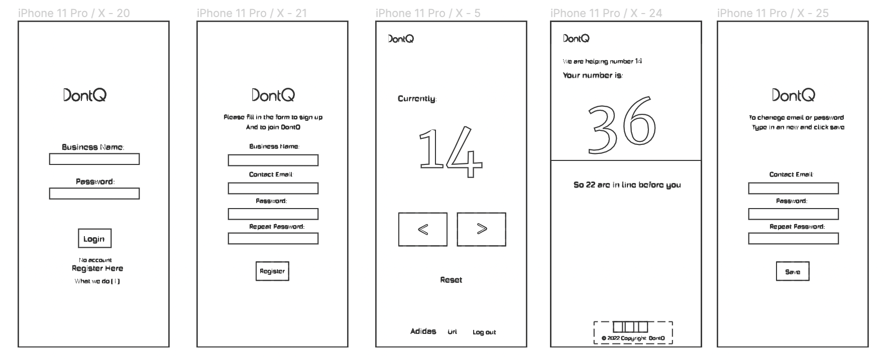
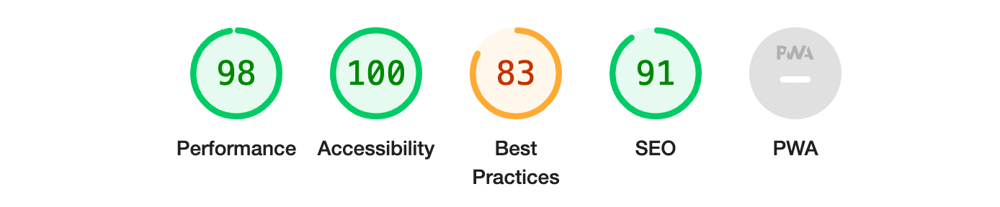

# DontQ
__Live Site:__
[DontQ](https://emmabergner.github.io/dontq/) 

DontQ is a queuing web browser application and service where businesses can offer their customers an easy and sustainable way of queueing. With DontQ, your customer will receive an queueing number straight in the phone. 

By scanning a QR-code when entering the store customers will automatically receive their queueing number. They will be updated on current number, remaining queueing numbers and a message when it is their turn. 

The idea is, instead of printing out tickets when entering stores (for business useing this type of queing system) everything is online and on personal devices. This application is a sustainable way of thinking and can be used in any store that uses any sort of queuing system, using numbers. 

## User Experience
### User Stories
__User/Customer__
- As a user I want a queue number so that I know when it is my turn.
- As a user I want to be updated on the current number so that I can claim my turn in time.
- As a user I want to have a more graphic design so I can easily see when it's my turn.

__Business__
- As a business I want to be able to control the current number so that the queue number is correct.
- As a business I want to be able to sign in with username and password so that I can access my queue.

__Superuser / Admin__
- As a site owner I want to be able to add new businesses so that they can use the service.
- As a site owner I want to be able to remove businesses so that they can not use the service.
- As a site owner I want to have separate queues so that more then one business can use my service at the same time.
- As a site owner I want businesses to register themselves to make things more smooth.

## Features
__How to use the application DontQ.__

### Login Page
The login page is the home page for businesses using the application. From there they can read about DontQ, register a new business and sign in to get access to the control page. 

Home Page

Head Logo

Login section 

Functions 

Infomation 

### Register Page
The register page is where new business can register their business. A business is able to have one account and not more. If an exciting business is trying to register, they will recireceive an error message guiding them to login.  

Create Account 

"Already have account"

"Password don't match"

### Control Page
The control page is where businesses control their individual queueing system after they login. With the options of rising or increasing the current number. If necessary or when starting a new day, the reset button comes to handy. The queue starts with number 1. For clients to receive tickets, they need to load the URL. An easy way to achieve this is to place a copy of the OR code in the shop.

Head Page

Button Control 

Reset 

Menu Options

Url Code

### Update Page
The update page is if businesses wants to change or update email or password, or if they want to delete their account. 

Update Business Info

### User Page 
The user page is where users see their individual queueing ticket by scaning the QR code or copying the Url. This is where they will be updated on the current and remaining queue number. 

Updated Queue

### Future Features
I would like to add: 
- Give and update clients the expected estimated waiting time.
- Give clients an cancellation option.
- Give clients the option to skip my turn and let the person with the number behind go before my turn. 
- Give business the option to create thier own design, choosing font-colors, background photos and edit text. 

## Design  
__Color Scheme__
I wanted to keep the color scheme simple for this project so I chose colors that work nicley together. Two dark colors, two pop colors and one light color. 

__Wireframes__
My wireframe and design were created using Figma. 

## Technologies Used
### Languages Used
- HTML 
- CSS
- Python 
- JavaScript 

## Frameworks, Libraries and Programmes Used
- __GitHub:__
    GitHub was used to store the code for the project. 

- __GitPod:__
     GitPod was used to provide the programming environment. 

- __Django__
    Django is a python based framework that was used to develop the web application.

- __PostgreSQL__
    PostgreSQL is database being used. 

-  __Heroku__ 
    Heroku is a cloud based application platform connected to GitHub, used to deploy this project.

- __Google Fonts:__
    Google Fonts was used to import the font Jura, Merriweather and Poiret One as the fonts for this project.

- __Font Awesome:__
    Font Awesome was used for the fullscreen button icon.

- __Photoshop:__
    Photoshop was used to resize and to edit background image.

- __Trello__
    Trello was used for adding user stories, tasks and to fallow the project. 

- __Figma__
    Figma is a wireframing tool and helped with the design for this project. 

## Testing 
### Validator Testing 
- HTML
  - No errors were returned when passing through the official W3C validator: 
  [W3C validator](https://validator.w3.org/nu/?doc=https%3A%2F%2Femmabergner.github.io%2Fblink%2F)

- CSS
  - No errors were found when passing through the official (Jigsaw) validator: [Jigsaw validator](https://jigsaw.w3.org/css-validator/validator?uri=https%3A%2F%2Femmabergner.github.io%2Fblink%2F&profile=css3svg&usermedium=all&warning=1&vextwarning=&lang=en)

- JavaScript
  - No errors was found when passing through the official [Jshint validator](https://jshint.com/)
    - There are 11 functions in this file.
    - Function with the largest signature take 3 arguments, while the median is 1.
    - Largest function has 11 statements in it, while the median is 2.
    - The most complex function has a cyclomatic complexity value of 4 while the median is 1.

- PEP8
    - The code was validated using PEP8. No errors were returned.

- Accessibility 
  - The colors and fronts are easy to read and accessible by running it through lighthouse in devtools. 

 

## Manual Testing 

__Add Business__ 
- A business can easily resister themself straight on the site. 

__Edit Business__ 
- Once the business has signed in, changing email or password i possible. 

__Delete Business__
The business can decide to delete thier account just by clicking the text that says delete.

Queue Infomation Update

## Bugs Found
The Url will be automaticly updated and will not work after some time. 

## Deployment

This project was deployed using Github and Heroku.

__Github__

Login to Github.
- Click the green "new" button and create new repository page.
- Chose a repository name then clicked the green "create repository button" at the bottom of the page.
- Clicked the green ‘Gitpod’ button to create a workspace in Gitpod for editing.

__Heroku__

Login to Heroku.
- Create a "New App" and give it a name, it must be unique.
- Click "Create App" and this will take you to a page where you can deploy your project.

- Click on the 'Resources' tab and search for 'Heroku Postgres' in the Add-ons section to add the Heroku Postgres database to the project.
- Click on the 'Settings' tab at the top of the page. The following steps must be completed before deployment.
- Click 'Reveal Config Vars'. Here the database URL is stored, it is the connection to the database, so this must be copied and stored within env.py file within the same directory as the manage.py file.

- To deploy the project go to the deploy tab and scroll  down to the end and deploy our branch.
- View the build log to make sure that everything works okay.
- The app has been deployed to Heroku.

To get the Django framework installed and set up I followed Code Institutes Django [sheet](https://codeinstitute.s3.amazonaws.com/fst/Django%20Blog%20Cheat%20Sheet%20v1.pdf)

## Credit

Instuctions on Heruko and Django was found [here](https://docs.google.com/document/d/1P5CWvS5cYalkQOLeQiijpSViDPogtKM7ZGyqK-yehhQ/edit)

[W3School](https://www.w3schools.com/) helped me out with CSS and HTML code. 

My QR code was created [here](https://www.the-qrcode-generator.com/) 