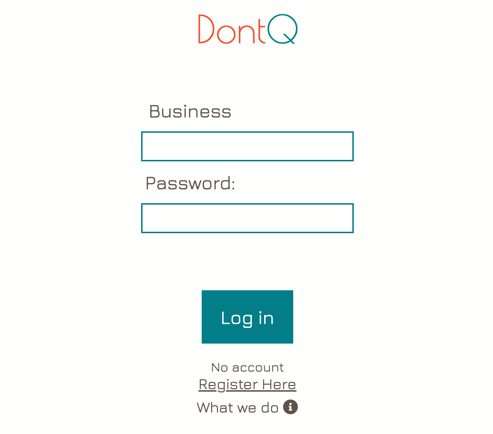
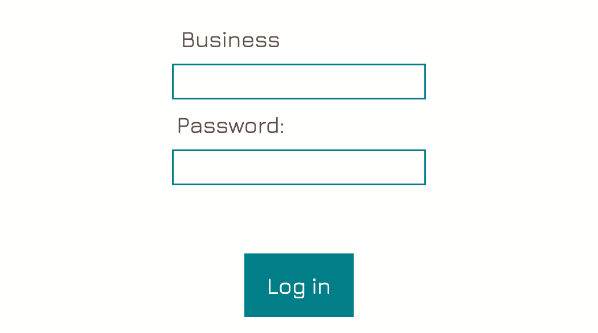
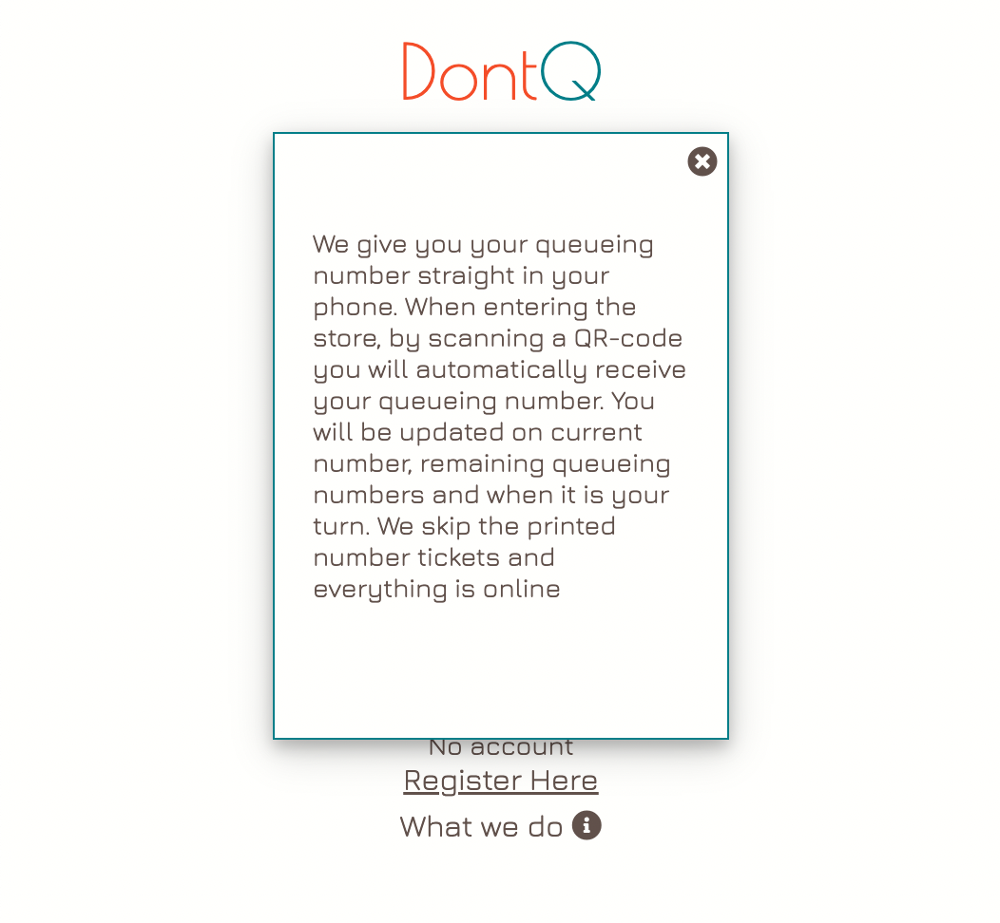
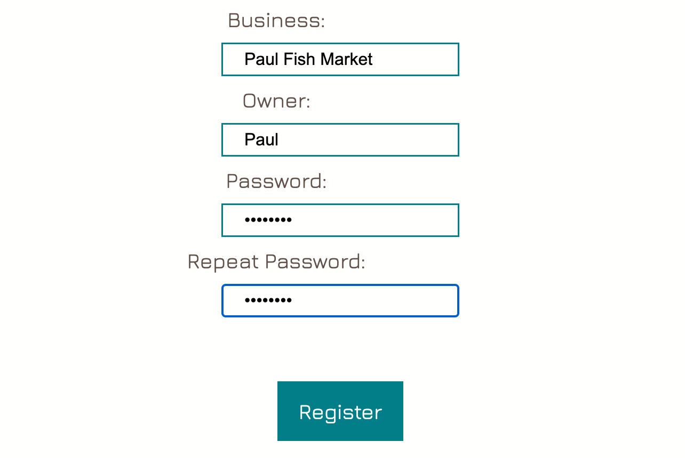

# DontQ
__Live Site:__
[DontQ](https://emmabergner.github.io/dontq/) 

DontQ is a queuing web browser application and service where businesses can offer their customers an easy and sustainable way of queueing. With DontQ, your customer will receive an queueing number straight in the phone. 

By scanning a QR-code when entering the store customers will automatically receive their queueing number. They will be updated on current number, remaining queueing numbers and a message when it is their turn. 

The idea is, instead of printing out tickets when entering stores (for business useing this type of queing system) everything is online and on personal devices. This application is a sustainable way of thinking and can be used in any store that uses any sort of queuing system, using numbers. 

## User Experience
### User Stories
__User/Customer__
- As a user I want a queue number so that I know when it is my turn.
- As a user I want to be updated on the current number so that I can claim my turn in time.
- As a user I want to have a more graphic design so I can easily see when it's my turn.

__Business__
- As a business I want to be able to control the current number so that the queue number is correct.
- As a business I want to be able to sign in with username and password so that I can access my queue.

__Superuser / Admin__
- As a site owner I want to be able to add new businesses so that they can use the service.
- As a site owner I want to be able to remove businesses so that they can not use the service.
- As a site owner I want to have separate queues so that more then one business can use my service at the same time.
- As a site owner I want businesses to register themselves to make things more smooth.

## Features
How do use the application
- The login page is the home page for businesses using the application. From there you can, get more information about what DontQ, register a new business and sign in. 

- The register page is where new business can register their business. A business is able to have one account and not more. If an exciting business is trying to register, they will recireceive an error message guiding them to login.  

- The business page is where businesses control their individual queueing system after they login. With the options of rising or increasing the current number. If necessary or when starting a new day, the reset button comes to handy. The queue starts with number 1. For your clients to receive tickets, they need to load the below URL. An easy way to achieve this is to place a copy of the OR code in your shop.

- The user page is where users see their individual queueing ticket. By scaning the QR code in the shop. This is where they will be updated on the current and remaining queue number. 

### Login Page
Home Page

Head Logo

Login section 

Functions 

Infomation 

### Register Page
Home Page

Create Account 

Features
"Already have account"

"Password don't match"

### User Page 

### Business Page
### Update Page

### Future Features
I would like to add: 
- Give and update clients the expected estimated waiting time.
- Give clients an cancellation option.
- Give clients the option to skip my turn and let the person with the number behind go before my turn. 
- Give business the option of thier own design, choosing font-colors, background photos and edit text. 

## Design  

__Color Scheme__

I wanted to keep the color scheme simple for this project so I chose colors that work nicley together. Two dark colors, two pop colors and one light color. 

__Wireframes__
My wireframe and design were created using Figma. 

## Databases

## Technologies Used
### Languages Used
- HTML 
- CSS
- Python 
- JavaScript 

## Frameworks, Libraries and Programmes Used
- __GitHub:__
    GitHub was used to store the code for the project. 

- __GitPod:__
     GitPod was used to provide the programming environment. 

- __Django__
    Django is a python based framework that was used to develop the web application.

- __PostgreSQL__
    PostgreSQL is database being used. 

-  __Heroku__ 
    Heroku is a cloud based application platform connected to GitHub, used to deploy this project.

- __Google Fonts:__
    Google Fonts was used to import the font Jura, Merriweather and Poiret One as the fonts for this project.

- __Font Awesome:__
    Font Awesome was used for the fullscreen button icon.

- __Photoshop:__
    Photoshop was used to resize and to edit background image.

- __Trello__
    Trello was used for adding user stories, tasks and to fallow the project. 

- __Figma__
    Figma is a wireframing tool and helped with the design for this project. 

## Testing 

### Validator Testing 
- HTML
  - No errors were returned when passing through the official W3C validator: 
  [W3C validator](https://validator.w3.org/nu/?doc=https%3A%2F%2Femmabergner.github.io%2Fblink%2F)

- CSS
  - No errors were found when passing through the official (Jigsaw) validator: [Jigsaw validator](https://jigsaw.w3.org/css-validator/validator?uri=https%3A%2F%2Femmabergner.github.io%2Fblink%2F&profile=css3svg&usermedium=all&warning=1&vextwarning=&lang=en)

- JavaScript
  - No errors was found when passing through the official [Jshint validator](https://jshint.com/)
    - There are 11 functions in this file.
    - Function with the largest signature take 3 arguments, while the median is 1.
    - Largest function has 11 statements in it, while the median is 2.
    - The most complex function has a cyclomatic complexity value of 4 while the median is 1.

- __PEP8__

    The code was validated using PEP8. No errors were returned.

- Accessibility 
  - The colors and fronts are easy to read and accessible by running it through lighthouse in devtools. 

    

## Manual Testing 

Add Business 
A business can easily resister themself straight on the site. 
Edit Business 
- Once the business has signed in, changing email or password i possible. 
Delete Business
The business can decide to delete thier account just by clicking the text that says delete.   

## Bugs Found

## Deployment

This project was deployed using Github and Heroku.

Github
To create a new repository I took the following steps:

Logged into Github.
Clicked over to the ‘repositories’ section.
Clicked the green ‘new’ button. This takes you to the create new repository page.
Once there under ‘repository template’ I chose the code institute template from the dropdown menu.
I input a repository name then clicked the green ‘create repository button’ at the bottom of the page.
Once created I opened the new repository and clicked the green ‘Gitpod’ button to create a workspace in Gitpod for editing.

Django and Heroku
To get the Django framework installed and set up I followed the Code institutes Django Blog cheatsheet.

## Credit

Instuctions on Heruko
https://docs.google.com/document/d/1P5CWvS5cYalkQOLeQiijpSViDPogtKM7ZGyqK-yehhQ/edit

W3School 