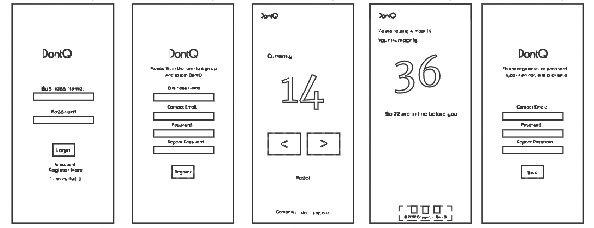
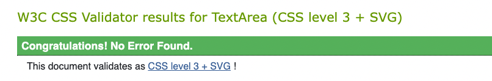

# DontQ
__Live Site:__
[DontQ](https://emmabergner.github.io/dontq/) 
DontQ is a queuing web browser application and service where your business can offer their customers an easy and sustainable way of queueing. With DontQ, your customer will receive an queueing number straight in the phone. 

By scanning a QR-code when entering the store, customers will instantly receive a place in the queue. They will be updated continuously on the queue's progress and receive a message on current number, remaining queueing numbers and a message when it is their turn. 

Everything is online and on personal devices. So for businesses currently using paper queueing tickets, this service is a more sustainable implementation of that system, with the additional benefits listed below.
The idea is, instead of printing out tickets when entering stores (for business using this type of queuing system) everything is online and on personal devices. This application is a sustainable way of thinking and can be used in any store that uses any sort of queuing system, using numbers. 

## The problem we want to solve

The idea for this project came from an own experience a couple of weeks ago when me and my friend [SE were] was trying to get a table at a restaurant. It was a sunny day and everywhere was packed, with a waiting list of up to 67 people. By giving my phone number I could be number 68 and the staff would contact me when it was my turn. I thought to myself, of this man standing with all phone numbers who needs to contact each and everyone saying that there is a table ready for them. 

In order for that business' system to work:
- Staff has to have the time to go through the list and make these phone calls. 
- Customers have to be open to giving out their phone number to the business.
- Customers have to be close enough to the business in order to make it back for their turn once they get the call, in spite of not knowing when that will be. 

For a business with higher through-put, like a shop, phoning each customer is not an option, so customers have to stay in the shop to claim their turn at the right time.

Pain points with this system:
- The shop can get crowded, providing an unpleasant environment for all involved.
- Customers are prevented from using the time in the queue for better things.
- If queueing tickets are used, these are a cost, a waste of paper, and a source of litter.

## The solution

To adress and replace the lack in this system, with a digital and remotely system where customers can fallow their queueing process themselves. 

Changes so customers can:
- Step outside and fallow the queue from a distance.
- Make other errands while waiting for their turn. 

Each customer (user, for the rest of this document), interfaces the service through a web page that provides:
- That user's queue number.
- Number of people in frontline before that user.

The business uses a different interface, a web page that:
- Displays the queue number of the latest user being served.
- Allows incrementing (and decrementing in case of a mistake) the queue number to be served.

## Project Plan 
I used Trello to plan and to fallow up with my project. 

### User Stories
__User/Customer__
- As a user I want a queue number so that I know when it is my turn.
- As a user I want to be updated on the current number so that I can claim my turn in time.

__Business__
- As a business I want to be able to control the current number so that the queue number is correct.
- As a business I want to be able to sign in with username and password so that I can access my queue.

__Superuser / Admin__
- As a site owner I want to be able to add new businesses so that they can use the service.
- As a site owner I want to be able to remove businesses so that they can not use the service.
- As a site owner I want to have separate queues so that more then one business can use my service at the same time.
- As a site owner I want businesses to register themselves to make things more smooth.

## Features

The logo appears on all pages, users will easily know they are using DontQ services.

### Login Page

The login page is the home page for businesses using the application. Businesses can read about us, register a new business and sign in to get access to the control page. 

- This is the first page businesses see. 
- Businesses who already is registered can login. 
- Businesses can register an new account. 

- More information can be found about what we do here.

### Register Page

The register page is where a new business can register their business. This is where you fill in the fallowing information to register a new account. 

- Incase a business already has an account with us they will receive a message telling them to login. 
- Incase a business types in a password that don't match they will receive a message telling them to try again. 

### Control Page

The control page is where businesses control their individual queueing system after they login. The queue starts with number 1. For users to receive tickets, they need to load the URL. An easy way to achieve this is to place a copy of the OR code in the shop.

- After signing in with a business this is what they will see and from here they have access to their queue. 
- This is where the business controls the queue.
- When clicking on the green button the number will increase with one and when clicking on the white button the number will decrease with one. 
- With one click the business can reset the queue , just before opening in the morning when they want the number to begin with 0 could be an typical case for this. 

- A menu can be found in the footer of the page. 
- Under the business name information can be edited by clicking on the name. 
- The business can find their personal Url-code to give out to their custmumors. 
- By clicking on logout, the business has signed out. 

- The business can offer users their url or place a copy of the OR code in the shop for user to scan. 

### Update Page 

The update page is where the business can change their login information. 
- By clicking on the business name and edit logo the business will be able to update and change email adress or password. By pressing save, this information will be saved. 
- Businesses are also able to delete their account with us just by clicking on the delete account text. 

### User Page 

The user page is where users see their individual queueing ticket after scanning the QR code or copying the Url. This is where users will be updated on the current and remaining queue number. 
 
- Users will receive information about what number is being served at the moment.
- What queue number they have themselves. 
- How many people are inline before. 
- This will be updated and when coming close to being your turn you will receive a message on the screen.

- When one person is in line before, the number will change to a message saying "You are next in line". 
- When it is your turn, you will receive the message "It is your turn". 
- If for some reason you happen to miss your turn, you will receive the message "You missed out". 

### Future Features
I would like to add: 
- Give and update clients the expected estimated waiting time.
- Give clients a cancellation option.
- Give clients the option to skip my turn and let the person with the number behind go before my turn. 
- Give business the option to create their own design, choosing font-colors, background photos and edit text. 

## Design  
__Color Scheme__
I wanted to keep the color scheme simple for this project so I chose colors that work nicely together. Two dark colors, two pop colors and one light color. 

__Wireframes__
My wireframe and design were created using Figma. 

## Technologies Used
### Languages Used
- HTML 
- CSS
- Python 
- JavaScript 

## Frameworks, Libraries and Programmes Used
- __GitHub__
    was used to store the code for the project. 
- __GitPod__
    was used to provide the programming environment. 
- __Django__
    is a python based framework that was used to develop the web application.
- __PostgreSQL__
    is database being used. 
-  __Heroku__ 
    is a cloud based application platform connected to GitHub, used to deploy this project.
- __Google Fonts__
    was used to import the font Jura, Merriweather and Poiret One as the fonts for this project.
- __Font Awesome__
    was used for the fullscreen button icon.
- __Photoshop:__
    was used to resize and to edit background image.
- __Trello__
    was used for adding user stories, tasks and to manage the project. 
- __Figma__
    is a wireframing tool and helped with the design for this project. 
- __URL__
    was endcode and decode by importing [urllib.parse]() into the file.

## Testing 
### Validator Testing 
- HTML
  - No errors were returned when passing through the official W3C validator: 
   

- CSS
  - No errors were found when passing through the official (Jigsaw) validator:  

- PEP8
    - The code was validated using PEP8. No errors were returned.

- JavaScript
  - No errors was found when passing through the official [Jshint validator](https://jshint.com/)

- Accessibility 
  - The colors and fronts are easy to read and accessible by running it through lighthouse in devtools. 

## Manual Testing 
The final version was tested by using each function on each page.

Login page: 
- Verify that both correct login and incorrect login are handled. 
- Verify that the registration link works.

Register page: 
- Verify that a new business can be registered. 
- Verify that business does not already exist. 
- Verify that both password entered match with each other. 
- Verify that the login link works. 

Control page: 
- Verify that the number changes by clicking on the arrow < and >.
    - By clicking the button marked > the number is incremented.
    - By clicking the button marked > and then the button marked < the number is unchanged. 
    - By clicking the button marked <, then click it one more time the number is still 0. 
- Verify that the reset button restart with the number 0. 
- Verify that the URL code match with the business signed in. 
- Verify that the edit icon link works.
- Verify that the logout link works. 

Update page: 
- Verify that new email or password is saved by clicking on the save button. 
- Verify that both password entered match with each other. 
- Verify that by changing only email and saving, the business returns to the control page. 
- Verify that business automatically is singed out after changing password but not email. 
- Verify that account get deleted by clicking on the text that says delete. 
 
User page: 
- Verify that text and number match together. 
- Verify that socialmedia link works. 

## Bugs Found
No bugs found. 

## Deployment

This project was deployed using Github and Heroku.

__Github__

Login to Github.
- Click the green "new" button and create new repository page.
- Chose a repository name then clicked the green "create repository button" at the bottom of the page.
- Clicked the green ‘Gitpod’ button to create a workspace in Gitpod for editing.

__Heroku__

Login to Heroku.
- Create a "New App" and give it a name, it must be unique.
- Click "Create App" and this will take you to a page where you can deploy your project.

- Click on the 'Resources' tab and search for 'Heroku Postgres' in the Add-ons section to add the Heroku Postgres database to the project.
- Click on the 'Settings' tab at the top of the page. The following steps must be completed before deployment.
- Click 'Reveal Config Vars'. Here the database URL is stored, it is the connection to the database, so this must be copied and stored within env.py file within the same directory as the manage.py file.

- To deploy the project go to the deploy tab and scroll  down to the end and deploy our branch.
- View the build log to make sure that everything works okay.
- The app has been deployed to Heroku.

To get the Django framework installed and set up I followed Code Institutes Django [sheet](https://codeinstitute.s3.amazonaws.com/fst/Django%20Blog%20Cheat%20Sheet%20v1.pdf)

## Credit

- Instuctions on Heruko and Django was found [here](https://docs.google.com/document/d/1P5CWvS5cYalkQOLeQiijpSViDPogtKM7ZGyqK-yehhQ/edit)

- [W3School](https://www.w3schools.com/) helped me out with CSS and HTML code. 

- [Slackoverflow](https://stackoverflow.com/) helped me out with code solutions throughout the project.

- My favicon was created [here](https://icons8.com/icon/66752/circled-q) and converted [here](https://hnet.com/png-to-ico/)

