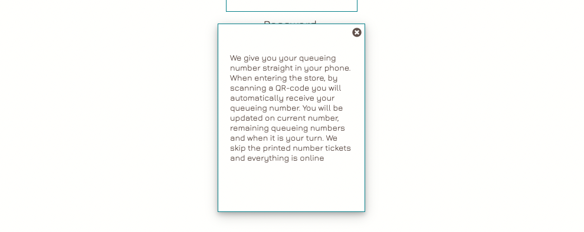

# DontQ
__Live Site:__
[DontQ](https://emmabergner.github.io/dontq/) 

The name DontQ stands for: Do not queue (in a physical queue).

DontQ is a web browser application and service where your business can offer their customers an easy and sustainable way of queueing. With DontQ, your customer will receive a queueing number straight in the phone.

Customers will instantly receive a place in queue by scanning a QR-code when entering a store. They will be updated continuously on the queue's progress and receive a message when it is their turn. 

Everything is online and on personal devices. So for businesses currently using paper queueing tickets, this service is a more sustainable implementation of that system, with the additional benefits listed below.

## The problem we want to solve
The idea for this project came from my own experience a couple of weeks ago when me and my friend were trying to get a table at a restaurant. It was a sunny day and everywhere was packed, with a waiting list of up to 67 people. By giving my phone number I would be number 68 inline and the staff would contact me when it was my turn. I thought to myself, there must be an easier way of doing this other than contacting each and everyone by phone to say that there is a table ready for them. 

In order for that business' system to work:
- Staff has to have the time to make these phone calls. 
- Customers have to be open to giving out their phone number to the business.
- Customers have to be close enough to the business in order to make it back for their turn once they get the call, in spite of not knowing when that will be. 

For a business with higher through-put, like a shop, phoning each customer is not an option, so customers have to stay in the shop to claim their turn at the right time. Pain points with this system:
- The shop can get crowded, providing an unpleasant environment for all involved.
- Customers are prevented from using the time in the queue for better things.
- If queueing tickets are used, they are a cost, a waste of paper, and a source of litter.

## The solution
To address the issues in these systems, I want to create an online service where customers can follow their queueing progress themselves. With this solution customers can step outside, follow the queue from a distance and do other errands while waiting for their turn. 

Each customer (user, for the rest of this document), interfaces the service through a web page that provides:
- That user's queue number.
- Number of people in line before that user.

The business uses a different interface, a web page that:
- Displays the queue number of the latest user being served.
- Allows incrementing (and decrementing in case of a mistake) the queue number to be served.

## Features
#### __Logo__
The name and the logo DontQ appears on all pages. Users will knows they are using the service by seeing this logo.

### The Business Interface

#### __Login Page__
The login page is the first page a business will see when using the service. From here there are three ways to continue:
- Open the information box for find more information about what we do.
- Register a new business to sign in. 
- If already registered simply sign in to get access to the control page.  

#### __Information box__
The information box offers general information about the service for new visitors. 

#### __Register Page__
The register page is for new businesses where they fill in the following information to register a new account. 

There are two important rules here to follow: 

- A business can only have one account with us. In case a business already has signed up with us they will receive a message guiding them to log in. 

- It is important to get the password right. In case the first box doesn't match with the second box a message will guide them to try again. 

#### __Control Page__
Once logged in, the control page is where the business controls their individual queueing system. The queue always starts with number 1. The number 0 menas that serving the queue hasn't started yet. There are three main options here: 
- Incrementing the queue number with the green button (most common).
- Decrementing the queue number with the white button (in case of mistake).  
- The business can reset the queue to 0. Before opening in the morning is the typical case for this. 

The footer contains a menu of three additional options: 
- Under the business name, registration information can be edited and changed. 
- Clicking on "User URL" brings up the User URL display box, where the business can find the URL for their user page. 
- By clicking on "Log out", the business logs out. 

#### __User URL Display Box__
For users to receive tickets, they need to load the URL. An easy way to achieve this is to place a copy of the QR code in the shop.

#### __Update Information Page__ 
The update page is where the business can change their login registation. There are three options:
- Change current email adress.
- Change current password. 
- Delete their account with us just by clicking "Delete Account".

 

### The User Interface

#### __User Page__
The user page is where users see their individual queueing ticket after scanning the QR code in the store. This is where they will be updated continuously on the queue's progress. There are one static and two dynamic pieces of information here: 

- User's place in the queue (static).
- Current place in the queue being served at the moment.
- Number in line ahead of the user. 

#### __Special Cases__
When coming close to being their turn the user will receive a updated message on the screen:
- When only one person is in line ahead: "You are next in line". 
- When it is the user's turn: "It is your turn". 
- If for some reason they happen to miss their turn: "You missed out". 

### Future Features
There are many ways to extend the capabilities of the service. For instance I would like to add: 
- Update user on the expected estimated waiting time.
- Give users a cancellation option.
- Give user the option to let the person with the number behind go before their turn. 
- Give businesses the option to create their own design, choosing font-colors, background photos and adding informational text. 

## Project Plan 
I used Trello to plan and to follow up with my project. 

### User Stories
__User__
- As a user I want a queue number so that I know when it is my turn.
- As a user I want to be updated on the current number so that I can claim my turn in time.

__Business__
- As a business I want to be able to control the current number so that the queue number is correct.
- As a business I want to be able to sign in with username and password so that I can access my queue.

__Site Owner__
- As a site owner I want businesses to register themselves to make things more smooth.
- As a site owner I want to have separate queues so that more then one business can use my service at the same time.
- As a site owner I want to be able to add new businesses so that they can use the service.
- As a site owner I want to be able to remove businesses so that they can not use the service.

## Design  
__Color Scheme__

I wanted to keep the color scheme simple for this project so I chose i minimum of colors (that work nicely together). Two dark colors, two pop colors and one light color. 

__Favicon__ 

My favicon is a Q stands for queue just like my logo does. The favicon has the same color as the Q in the logo and was created with the webserver icons8. 

__Wireframes__

I created my wireframes and the design using Figma. 

## Technologies Used
### Languages Used
- HTML 
- CSS
- Python 
- JavaScript 

## Frameworks, Libraries and Programmes Used
- __GitHub__
    was used to store the code for the project. 
- __GitPod__
    was used to provide the programming environment. 
- __Django__
    is a python based framework that was used to develop the web application.
- __PostgreSQL__
    is the DBMS being used. 
-  __Heroku__ 
    is a cloud based application platform connected to GitHub, used to deploy this project.
- __Google Fonts__
    was used to import the font Jura, Merriweather and Poiret One as the fonts for this project.
- __Font Awesome__
    was used for some of the icons.
- __Photoshop:__
    was used to resize and to edit background image.
- __Cloudinary:__ 
    was used to store images online.
- __Trello__
    was used for keeping track of user stories, tasks and to manage the project. 
- __Figma__
    is a graphic design tool and helped with the design for this project. 
- __Urlib.parse__
     is used to encode and decode some URLs (in case business name contains tricky characters) and the code was found [here](https://www.urldecoder.io/python)

## Testing 
### Validator Testing 
- HTML
  - No errors were returned when passing through the official W3C validator: 
   

- CSS
  - No errors were found when passing through the official (Jigsaw) validator:  

- PEP8
    - The code was validated using PEP8. No errors were returned.

- JavaScript
  - No errors was found when passing through the official [Jshint validator](https://jshint.com/)

- Lighthouse 
  - The colors and fonts are easy to read and accessible by running it through lighthouse in devtools. 

## Manual Testing 
The final version was tested by using each function on each page.

Login page: 
- Verify that both correct login and incorrect login are handled. 
- Verify that the registration link works.

Register page: 
- Verify that a new business can be registered. 
- Verify that business does not already exist. 
- Verify that both password entered match with each other. 
- Verify that the login link works. 

Control page: 
- Verify that the number changes by clicking on the arrow < and >.
    - By clicking the button marked > the number is incremented.
    - By clicking the button marked > and then the button marked < the number is unchanged. 
    - The number shall never be less than 0.
- Verify that the reset button restart with the number 0. 
- Verify that the URL code match with the business signed in. 
- Verify that the edit icon link works.
- Verify that the logout link works. 

Update page: 
- Verify that new email or password is saved by clicking on the save button. 
- Verify that both password entered match with each other. 
- Verify that by changing only email and saving, the business returns to the control page. 
- Verify that business automatically is singed out after changing password but not email. 
- Verify that account get deleted by clicking on the text that says delete. 
 
User page: 
- Verify that text and number match together. 
- Verify that socialmedia link works. 

## Bugs Found
No known bugs. 

## Deployment
This project was deployed using Github and Heroku.

__Github__

Login to Github.
- Click the green "new" button and create new repository page.
- Chose a repository name then clicked the green "create repository button" at the bottom of the page.
- Clicked the green ‘Gitpod’ button to create a workspace in Gitpod for editing.

__Heroku__

Login to Heroku.
- Create a "New App" and give it a name, it must be unique.
- Click "Create App" and this will take you to a page where you can deploy your project.

- Click on the 'Resources' tab and search for 'Heroku Postgres' in the Add-ons section to add the Heroku Postgres database to the project.
- Click on the 'Settings' tab at the top of the page. The following steps must be completed before deployment.
- Click 'Reveal Config Vars'. Here the database URL is stored, it is the connection to the database, so this must be copied and stored within env.py file within the same directory as the manage.py file.

- To deploy the project go to the deploy tab and scroll  down to the end and deploy our branch.
- View the build log to make sure that everything works okay.
- The app has been deployed to Heroku.

To get the Django framework installed and set up I followed Code Institutes Django [sheet](https://codeinstitute.s3.amazonaws.com/fst/Django%20Blog%20Cheat%20Sheet%20v1.pdf)

## Credit
- Instructions on Heruko and Django was found [here](https://docs.google.com/document/d/1P5CWvS5cYalkQOLeQiijpSViDPogtKM7ZGyqK-yehhQ/edit)

- [W3School](https://www.w3schools.com/) helped me out with CSS and HTML code. 

- [Slackoverflow](https://stackoverflow.com/) helped me out with code solutions throughout the project.

- My favicon was created [here](https://icons8.com/icon/66752/circled-q) and converted [here](https://hnet.com/png-to-ico/)

